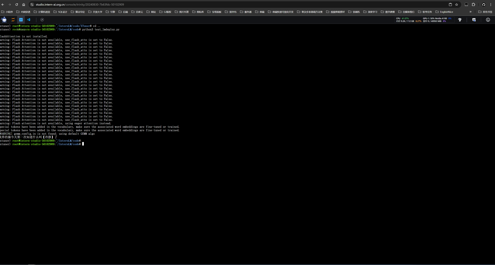
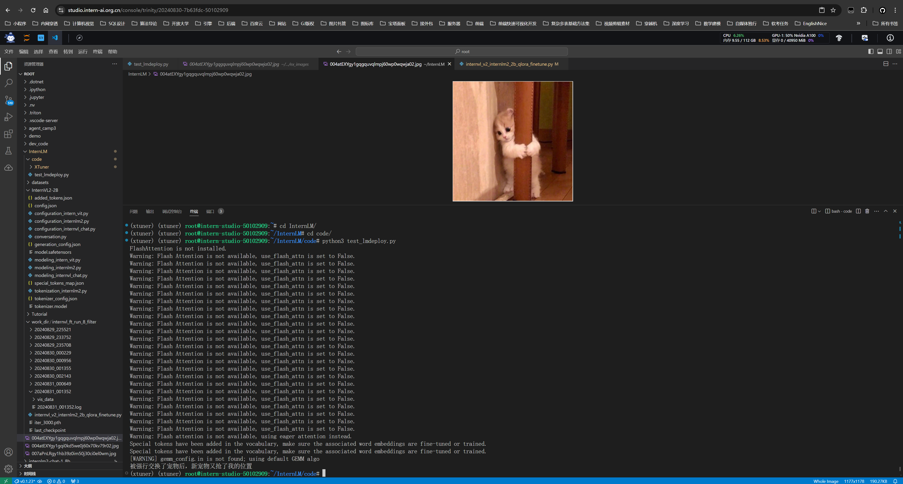

## 写在前面（什么是InternVL）
InternVL 是一种用于多模态任务的深度学习模型，旨在处理和理解多种类型的数据输入，如图像和文本。它结合了视觉和语言模型，能够执行复杂的跨模态任务，比如图文匹配、图像描述生成等。通过整合视觉特征和语言信息，InternVL 可以在多模态领域取得更好的表现

## InternVL 模型总览


对于InternVL这个模型来说，它vision模块就是一个微调过的ViT，llm模块是一个InternLM的模型。对于视觉模块来说，它的特殊之处在Dynamic High Resolution。

## Dynamic High Resolution

InternVL独特的预处理模块：动态高分辨率，是为了让ViT模型能够尽可能获取到更细节的图像信息，提高视觉特征的表达能力。对于输入的图片，首先resize成448的倍数，然后按照预定义的尺寸比例从图片上crop对应的区域。细节如图所示。


## Pixel Shuffle
Pixel Shuffle在超分任务中是一个常见的操作，PyTorch中有官方实现，即nn.PixelShuffle(upscale_factor) 该类的作用就是将一个tensor中的元素值进行重排列，假设tensor维度为[B, C, H, W], PixelShuffle操作不仅可以改变tensor的通道数，也会改变特征图的大小。

## InternVL 部署微调实践

> 我们选定的任务是让InternVL-2B生成文生图提示词，这个任务需要VLM对图片有格式化的描述并输出。

让我们来一起完成一个用VLM模型进行冷笑话生成，让你的模型说出很逗的冷笑话吧。在这里，我们微调InterenVL使用xtuner。部署InternVL使用lmdeploy。

### 准备InternVL模型
我们使用InternVL2-2B模型。该模型已在share文件夹下挂载好，现在让我们把移动出来。
```bash
cd /root
mkdir -p model

# cp 模型

cp -r /root/share/new_models/OpenGVLab/InternVL2-2B /root/model/
```

### 准备环境

这里我们来手动配置下xtuner。

- 配置虚拟环境

```bash
conda create --name xtuner python=3.10 -y

# 激活虚拟环境（注意：后续的所有操作都需要在这个虚拟环境中进行）
conda activate xtuner

# 安装一些必要的库
conda install pytorch==2.1.2 torchvision==0.16.2 torchaudio==2.1.2 pytorch-cuda=12.1 -c pytorch -c nvidia -y
# 安装其他依赖
apt install libaio-dev
pip install transformers==4.39.3
pip install streamlit==1.36.0

```

- 安装xtuner

```bash
# 创建一个目录，用来存放源代码
mkdir -p /root/InternLM/code

cd /root/InternLM/code

git clone -b v0.1.23  https://github.com/InternLM/XTuner
```

进入XTuner目录

```bash
cd /root/InternLM/code/XTuner
pip install -e '.[deepspeed]'
```

- 安装LMDeploy
  
```bash
pip install lmdeploy==0.5.3
```

- 安装验证

```bash
xtuner version

##命令

xtuner help
```


> 确认一下你的版本号和我们一致哦～

### 准备微调数据集

我们这里使用huggingface上的zhongshsh/CLoT-Oogiri-GO据集，特别鸣谢～。

```text
@misc{zhong2023clot,
  title={Let's Think Outside the Box: Exploring Leap-of-Thought in Large Language Models with Creative Humor Generation},
  author={Zhong, Shanshan and Huang, Zhongzhan and Gao, Shanghua and Wen, Weushao and Lin, Liang and Zitnik, Marinka and Zhou, Pan},
  journal={arXiv preprint arXiv:2312.02439},
  year={2023}
}
```


数据集我们从官网下载下来并进行去重，只保留中文数据等操作。并制作成XTuner需要的形式。并已在share里，我们一起从share里挪出数据集。

```bash
## 首先让我们安装一下需要的包
pip install datasets matplotlib Pillow timm

## 让我们把数据集挪出来
cp -r /root/share/new_models/datasets/CLoT_cn_2000 /root/InternLM/datasets/
```

让我们打开数据集的一张图看看，我们选择jsonl里的第一条数据对应的图片。首先我们先把这张图片挪动到InternLM文件夹下面。
```bash
cp InternLM/datasets/CLoT_cn_2000/ex_images/007aPnLRgy1hb39z0im50j30ci0el0wm.jpg InternLM/
```


哈哈，是两只猫在掐架。那我给到的冷笑话回复是什么呢？


### InternVL 推理部署攻略
我们用LMDeploy来推理这张图片～看看它能不能成功解释出梗图呢？

#### 使用pipeline进行推理

之后我们使用lmdeploy自带的pipeline工具进行开箱即用的推理流程，首先我们新建一个文件。

```bash
touch /root/InternLM/code/test_lmdeploy.py
cd /root/InternLM/code/
```

然后把以下代码拷贝进test_lmdeploy.py中。

```python
from lmdeploy import pipeline
from lmdeploy.vl import load_image

pipe = pipeline('/root/model/InternVL2-2B')

mage = load_image('/root/InternLM/007aPnLRgy1hb39z0im50j30ci0el0wm.jpg')
response = pipe(('请你根据这张图片，讲一个脑洞大开的梗', image))
print(response.text)
```
|图片内容|
|------|

||


运行执行推理结果。

```bash
python3 test_lmdeploy.py
```

#### 推理后

> 推理出来有什么文字是纯随机的，并不一定和展示结果完全一致哦～

推理后我们发现直接使用2b模型不能很好的讲出梗，现在我们要对这个2b模型进行微调。


### InternVL 微调攻略

#### 准备数据集
数据集格式为：

```json


# 为了高效训练，请确保数据格式为：
{
    "id": "000000033471",
    "image": ["coco/train2017/000000033471.jpg"], # 如果是纯文本，则该字段为 None 或者不存在
    "conversations": [
      {
        "from": "human",
        "value": "<image>\nWhat are the colors of the bus in the image?"
      },
      {
        "from": "gpt",
        "value": "The bus in the image is white and red."
      }
    ]
  }
```

> 这里我们也为大家准备好了可以直接进行微调的数据集。数据集就是咱们刚才复制进InternLM/datasets的数据。

#### 配置微调参数

> 让我们一起修改XTuner下 InternVL的config，文件在：
/root/InternLM/code/XTuner/xtuner/configs/internvl/v2/internvl_v2_internlm2_2b_qlora_finetune.py


- 需要修改的部分


最基础修改一下模型地址和数据地址即可。


- 总体config文件(复制即可)

```python
# Copyright (c) OpenMMLab. All rights reserved.
from mmengine.hooks import (CheckpointHook, DistSamplerSeedHook, IterTimerHook,
                            LoggerHook, ParamSchedulerHook)
from mmengine.optim import AmpOptimWrapper, CosineAnnealingLR, LinearLR
from peft import LoraConfig
from torch.optim import AdamW
from transformers import AutoTokenizer

from xtuner.dataset import InternVL_V1_5_Dataset
from xtuner.dataset.collate_fns import default_collate_fn
from xtuner.dataset.samplers import LengthGroupedSampler
from xtuner.engine.hooks import DatasetInfoHook
from xtuner.engine.runner import TrainLoop
from xtuner.model import InternVL_V1_5
from xtuner.utils import PROMPT_TEMPLATE

#######################################################################
#                          PART 1  Settings                           #
#######################################################################
# Model
path = '/root/model/InternVL2-2B'

# Data
data_root = '/root/InternLM/datasets/CLoT_cn_2000/'
data_path = data_root + 'ex_cn.json'
image_folder = data_root
prompt_template = PROMPT_TEMPLATE.internlm2_chat
max_length = 6656

# Scheduler & Optimizer
batch_size = 4  # per_device
accumulative_counts = 4
dataloader_num_workers = 4
max_epochs = 6
optim_type = AdamW
# official 1024 -> 4e-5
lr = 2e-5
betas = (0.9, 0.999)
weight_decay = 0.05
max_norm = 1  # grad clip
warmup_ratio = 0.03

# Save
save_steps = 1000
save_total_limit = 1  # Maximum checkpoints to keep (-1 means unlimited)

#######################################################################
#            PART 2  Model & Tokenizer & Image Processor              #
#######################################################################
model = dict(
    type=InternVL_V1_5,
    model_path=path,
    freeze_llm=True,
    freeze_visual_encoder=True,
    quantization_llm=True,  # or False
    quantization_vit=False,  # or True and uncomment visual_encoder_lora
    # comment the following lines if you don't want to use Lora in llm
    llm_lora=dict(
        type=LoraConfig,
        r=128,
        lora_alpha=256,
        lora_dropout=0.05,
        target_modules=None,
        task_type='CAUSAL_LM'),
    # uncomment the following lines if you don't want to use Lora in visual encoder # noqa
    # visual_encoder_lora=dict(
    #     type=LoraConfig, r=64, lora_alpha=16, lora_dropout=0.05,
    #     target_modules=['attn.qkv', 'attn.proj', 'mlp.fc1', 'mlp.fc2'])
)

#######################################################################
#                      PART 3  Dataset & Dataloader                   #
#######################################################################
llava_dataset = dict(
    type=InternVL_V1_5_Dataset,
    model_path=path,
    data_paths=data_path,
    image_folders=image_folder,
    template=prompt_template,
    max_length=max_length)

train_dataloader = dict(
    batch_size=batch_size,
    num_workers=dataloader_num_workers,
    dataset=llava_dataset,
    sampler=dict(
        type=LengthGroupedSampler,
        length_property='modality_length',
        per_device_batch_size=batch_size * accumulative_counts),
    collate_fn=dict(type=default_collate_fn))

#######################################################################
#                    PART 4  Scheduler & Optimizer                    #
#######################################################################
# optimizer
optim_wrapper = dict(
    type=AmpOptimWrapper,
    optimizer=dict(
        type=optim_type, lr=lr, betas=betas, weight_decay=weight_decay),
    clip_grad=dict(max_norm=max_norm, error_if_nonfinite=False),
    accumulative_counts=accumulative_counts,
    loss_scale='dynamic',
    dtype='float16')

# learning policy
# More information: https://github.com/open-mmlab/mmengine/blob/main/docs/en/tutorials/param_scheduler.md  # noqa: E501
param_scheduler = [
    dict(
        type=LinearLR,
        start_factor=1e-5,
        by_epoch=True,
        begin=0,
        end=warmup_ratio * max_epochs,
        convert_to_iter_based=True),
    dict(
        type=CosineAnnealingLR,
        eta_min=0.0,
        by_epoch=True,
        begin=warmup_ratio * max_epochs,
        end=max_epochs,
        convert_to_iter_based=True)
]

# train, val, test setting
train_cfg = dict(type=TrainLoop, max_epochs=max_epochs)

#######################################################################
#                           PART 5  Runtime                           #
#######################################################################
# Log the dialogue periodically during the training process, optional
tokenizer = dict(
    type=AutoTokenizer.from_pretrained,
    pretrained_model_name_or_path=path,
    trust_remote_code=True)

custom_hooks = [
    dict(type=DatasetInfoHook, tokenizer=tokenizer),
]

# configure default hooks
default_hooks = dict(
    # record the time of every iteration.
    timer=dict(type=IterTimerHook),
    # print log every 10 iterations.
    logger=dict(type=LoggerHook, log_metric_by_epoch=False, interval=10),
    # enable the parameter scheduler.
    param_scheduler=dict(type=ParamSchedulerHook),
    # save checkpoint per `save_steps`.
    checkpoint=dict(
        type=CheckpointHook,
        save_optimizer=False,
        by_epoch=False,
        interval=save_steps,
        max_keep_ckpts=save_total_limit),
    # set sampler seed in distributed evrionment.
    sampler_seed=dict(type=DistSamplerSeedHook),
)

# configure environment
env_cfg = dict(
    # whether to enable cudnn benchmark
    cudnn_benchmark=False,
    # set multi process parameters
    mp_cfg=dict(mp_start_method='fork', opencv_num_threads=0),
    # set distributed parameters
    dist_cfg=dict(backend='nccl'),
)

# set visualizer
visualizer = None

# set log level
log_level = 'INFO'

# load from which checkpoint
load_from = None

# whether to resume training from the loaded checkpoint
resume = False

# Defaults to use random seed and disable `deterministic`
randomness = dict(seed=None, deterministic=False)

# set log processor
log_processor = dict(by_epoch=False)
```

#### 开始训练

这里使用之前搞好的configs进行训练。咱们要调整一下batch size，并且使用qlora。要不半卡不够用的 QAQ。

```bash
cd XTuner

NPROC_PER_NODE=1 xtuner train /root/InternLM/code/XTuner/xtuner/configs/internvl/v2/internvl_v2_internlm2_2b_qlora_finetune.py  --work-dir /root/InternLM/work_dir/internvl_ft_run_8_filter  --deepspeed deepspeed_zero1
```


#### 合并权重&&模型转换

用官方脚本进行权重合并

> 如果这里你执行的epoch不是6，是小一些的数字。你可能会发现internvl_ft_run_8_filter下没有iter_3000.pth, 那你需要把iter_3000.pth切换成你internvl_ft_run_8_filter目录下的pth即可。

```bash
cd XTuner
# transfer weights
python3 xtuner/configs/internvl/v1_5/convert_to_official.py xtuner/configs/internvl/v2/internvl_v2_internlm2_2b_qlora_finetune.py /root/InternLM/work_dir/internvl_ft_run_8_filter/iter_3000.pth /root/InternLM/InternVL2-2B/
```

最后我们的模型在：/root/InternLM/convert_model/，文件格式：

```text
.
|-- added_tokens.json
|-- config.json
|-- configuration_intern_vit.py
|-- configuration_internlm2.py
|-- configuration_internvl_chat.py
|-- conversation.py
|-- generation_config.json
|-- model.safetensors
|-- modeling_intern_vit.py
|-- modeling_internlm2.py
|-- modeling_internvl_chat.py
|-- special_tokens_map.json
|-- tokenization_internlm2.py
|-- tokenizer.model
`-- tokenizer_config.json
```

### 微调后效果对比

现在我们微调好啦，让我们再来试试这张图片吧！


我们把下面的代码替换进test_lmdeploy.py中，然后跑一下效果。

```python
from lmdeploy import pipeline
from lmdeploy.vl import load_image

pipe = pipeline('/root/InternLM/InternVL2-2B')

image = load_image('/root/InternLM/007aPnLRgy1hb39z0im50j30ci0el0wm.jpg')
response = pipe(('请你根据这张图片，讲一个脑洞大开的梗', image))
print(response.text)
```

```python
cd /root/InternLM/code

python3 test_lmdeploy.py
```

效果还不错吧～哈哈哈。



附上一些其他有意思的例子，全都不是训练集里的（：




