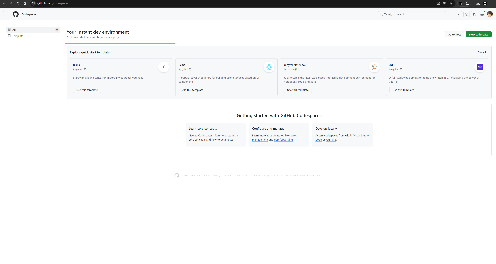
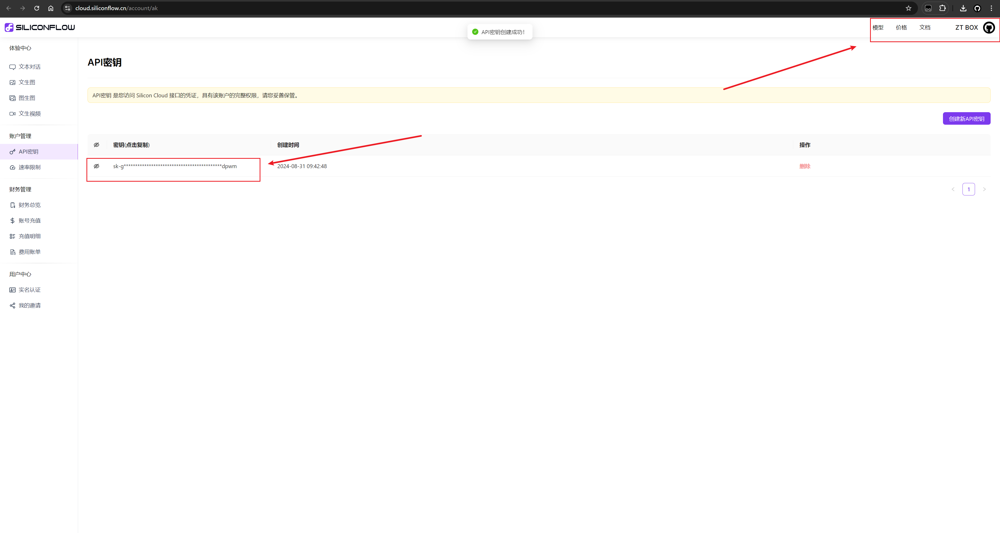
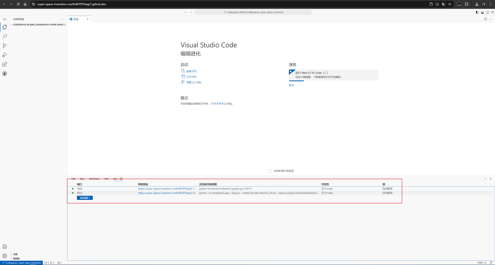
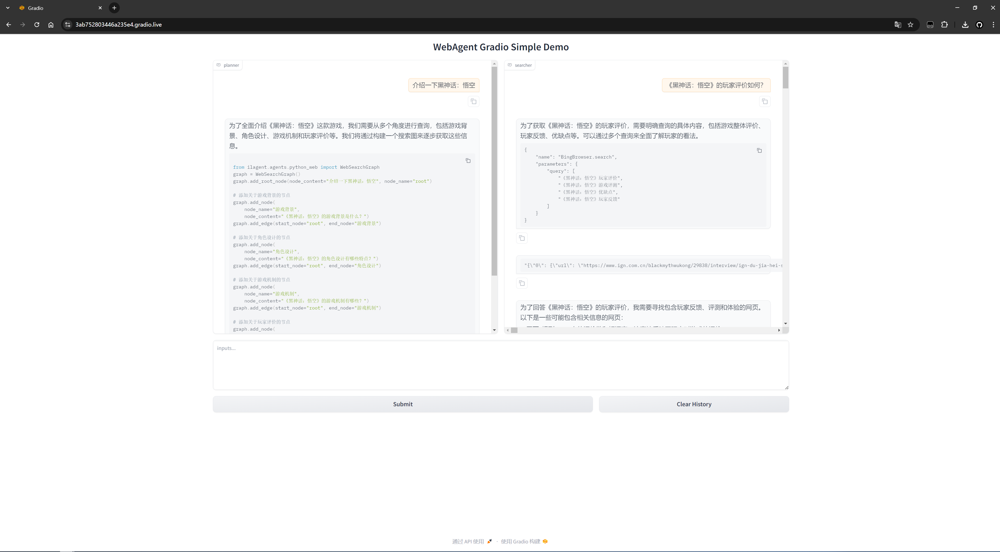
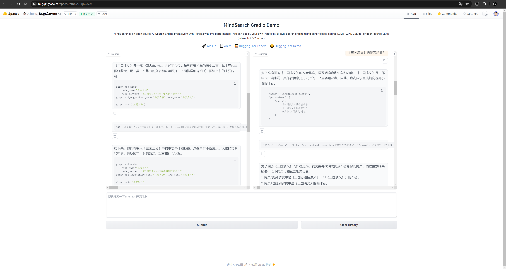

# MindSearch 部署到Github Codespace 和 Hugging Face Space

和[原有的CPU版本](https://github.com/InternLM/Tutorial/blob/camp3/docs/L2/MindSearch/readme.md)相比区别是把internstudio换成了github codespace。

随着硅基流动提供了免费的 InternLM2.5-7B-Chat 服务（免费的 InternLM2.5-7B-Chat 真的很香），MindSearch 的部署与使用也就迎来了纯 CPU 版本，进一步降低了部署门槛。那就让我们来一起看看如何使用硅基流动的 API 来部署 MindSearch 吧。

## 1. 创建开发机 & 环境配置

打开[codespace主页](https://github.com/codespaces)，选择blank template。



浏览器会自动在新的页面打开一个web版的vscode。


接下来的操作就和我们使用vscode基本没差别了。

然后我们新建一个目录用于存放 MindSearch 的相关代码，并把 MindSearch 仓库 clone 下来。在终端中运行下面的命令：

```bash
mkdir -p /workspaces/mindsearch
cd /workspaces/mindsearch
git clone https://github.com/InternLM/MindSearch.git
cd MindSearch && git checkout b832275 && cd ..
```

接下来，我们创建一个 conda 环境来安装相关依赖。

```bash
# 创建环境
conda create -n mindsearch python=3.10 -y
#第一次使用codespaces需要重启终端才能切换conda环境
source ~/.bashrc
# 激活环境
conda activate mindsearch
# 安装依赖
pip install -r /workspaces/mindsearch/MindSearch/requirements.txt
```

## 2. 获取硅基流动 API Key

因为要使用硅基流动的 API Key，所以接下来便是注册并获取 API Key 了。

首先，我们打开 https://account.siliconflow.cn/login 来注册硅基流动的账号（如果注册过，则直接登录即可）。

在完成注册后，打开 https://cloud.siliconflow.cn/account/ak 来准备 API Key。首先创建新 API 密钥，然后点击密钥进行复制，以备后续使用。



## 3. 启动 MindSearch

### 3.1 启动后端

由于硅基流动 API 的相关配置已经集成在了 MindSearch 中，所以我们可以直接执行下面的代码来启动 MindSearch 的后端。

```bash
export SILICON_API_KEY=sxxxxxxxxxm（第二步中复制的密钥）
conda activate mindsearch
cd /workspaces/mindsearch/MindSearch
python -m mindsearch.app --lang cn --model_format internlm_silicon --search_engine DuckDuckGoSearch
```

### 3.2 启动前端

在后端启动完成后，我们打开新终端运行如下命令来启动 MindSearch 的前端。

```bash
conda activate mindsearch
cd /workspaces/mindsearch/MindSearch
python frontend/mindsearch_gradio.py
```

前后端都启动后，我们应该可以看到github自动为这两个进程做端口转发。




由于使用codespace，这里我们不需要使用ssh端口转发了，github会自动提示我们打开一个在公网的前端地址。


然后就可以即刻体验啦。



如果遇到了 timeout 的问题，可以按照 [文档](./readme_gpu.md#2-使用-bing-的接口) 换用 Bing 的搜索接口。

## 4. 部署到 HuggingFace Space

最后，我们来将 MindSearch 部署到 HuggingFace Space。

我们首先打开 https://huggingface.co/spaces ，并点击 Create new Space，如下图所示。


在输入 Space name 并选择 License 后，选择配置如下所示。


然后，我们进入 Settings，配置硅基流动的 API Key。如下图所示。


选择 New secrets，name 一栏输入 SILICON_API_KEY，value 一栏输入你的 API Key 的内容。


最后，我们先新建一个目录，准备提交到 HuggingFace Space 的全部文件。

```bash
# 创建新目录
mkdir -p /workspaces/mindsearch/mindsearch_deploy
# 准备复制文件
cd /workspaces/mindsearch
cp -r /workspaces/mindsearch/MindSearch/mindsearch /workspaces/mindsearch/mindsearch_deploy
cp /workspaces/mindsearch/MindSearch/requirements.txt /workspaces/mindsearch/mindsearch_deploy
# 创建 app.py 作为程序入口
touch /workspaces/mindsearch/mindsearch_deploy/app.py
```

其中，app.py 的内容如下：

```python
import json
import os

import gradio as gr
import requests
from lagent.schema import AgentStatusCode

os.system("python -m mindsearch.app --lang cn --model_format internlm_silicon &")

PLANNER_HISTORY = []
SEARCHER_HISTORY = []


def rst_mem(history_planner: list, history_searcher: list):
    '''
    Reset the chatbot memory.
    '''
    history_planner = []
    history_searcher = []
    if PLANNER_HISTORY:
        PLANNER_HISTORY.clear()
    return history_planner, history_searcher


def format_response(gr_history, agent_return):
    if agent_return['state'] in [
            AgentStatusCode.STREAM_ING, AgentStatusCode.ANSWER_ING
    ]:
        gr_history[-1][1] = agent_return['response']
    elif agent_return['state'] == AgentStatusCode.PLUGIN_START:
        thought = gr_history[-1][1].split('```')[0]
        if agent_return['response'].startswith('```'):
            gr_history[-1][1] = thought + '\n' + agent_return['response']
    elif agent_return['state'] == AgentStatusCode.PLUGIN_END:
        thought = gr_history[-1][1].split('```')[0]
        if isinstance(agent_return['response'], dict):
            gr_history[-1][
                1] = thought + '\n' + f'```json\n{json.dumps(agent_return["response"], ensure_ascii=False, indent=4)}\n```'  # noqa: E501
    elif agent_return['state'] == AgentStatusCode.PLUGIN_RETURN:
        assert agent_return['inner_steps'][-1]['role'] == 'environment'
        item = agent_return['inner_steps'][-1]
        gr_history.append([
            None,
            f"```json\n{json.dumps(item['content'], ensure_ascii=False, indent=4)}\n```"
        ])
        gr_history.append([None, ''])
    return


def predict(history_planner, history_searcher):

    def streaming(raw_response):
        for chunk in raw_response.iter_lines(chunk_size=8192,
                                             decode_unicode=False,
                                             delimiter=b'\n'):
            if chunk:
                decoded = chunk.decode('utf-8')
                if decoded == '\r':
                    continue
                if decoded[:6] == 'data: ':
                    decoded = decoded[6:]
                elif decoded.startswith(': ping - '):
                    continue
                response = json.loads(decoded)
                yield (response['response'], response['current_node'])

    global PLANNER_HISTORY
    PLANNER_HISTORY.append(dict(role='user', content=history_planner[-1][0]))
    new_search_turn = True

    url = 'http://localhost:8002/solve'
    headers = {'Content-Type': 'application/json'}
    data = {'inputs': PLANNER_HISTORY}
    raw_response = requests.post(url,
                                 headers=headers,
                                 data=json.dumps(data),
                                 timeout=20,
                                 stream=True)

    for resp in streaming(raw_response):
        agent_return, node_name = resp
        if node_name:
            if node_name in ['root', 'response']:
                continue
            agent_return = agent_return['nodes'][node_name]['detail']
            if new_search_turn:
                history_searcher.append([agent_return['content'], ''])
                new_search_turn = False
            format_response(history_searcher, agent_return)
            if agent_return['state'] == AgentStatusCode.END:
                new_search_turn = True
            yield history_planner, history_searcher
        else:
            new_search_turn = True
            format_response(history_planner, agent_return)
            if agent_return['state'] == AgentStatusCode.END:
                PLANNER_HISTORY = agent_return['inner_steps']
            yield history_planner, history_searcher
    return history_planner, history_searcher


with gr.Blocks() as demo:
    gr.HTML("""<h1 align="center">MindSearch Gradio Demo</h1>""")
    gr.HTML("""<p style="text-align: center; font-family: Arial, sans-serif;">MindSearch is an open-source AI Search Engine Framework with Perplexity.ai Pro performance. You can deploy your own Perplexity.ai-style search engine using either closed-source LLMs (GPT, Claude) or open-source LLMs (InternLM2.5-7b-chat).</p>""")
    gr.HTML("""
    <div style="text-align: center; font-size: 16px;">
        <a href="https://github.com/InternLM/MindSearch" style="margin-right: 15px; text-decoration: none; color: #4A90E2;">🔗 GitHub</a>
        <a href="https://arxiv.org/abs/2407.20183" style="margin-right: 15px; text-decoration: none; color: #4A90E2;">📄 Arxiv</a>
        <a href="https://huggingface.co/papers/2407.20183" style="margin-right: 15px; text-decoration: none; color: #4A90E2;">📚 Hugging Face Papers</a>
        <a href="https://huggingface.co/spaces/internlm/MindSearch" style="text-decoration: none; color: #4A90E2;">🤗 Hugging Face Demo</a>
    </div>
    """)
    with gr.Row():
        with gr.Column(scale=10):
            with gr.Row():
                with gr.Column():
                    planner = gr.Chatbot(label='planner',
                                         height=700,
                                         show_label=True,
                                         show_copy_button=True,
                                         bubble_full_width=False,
                                         render_markdown=True)
                with gr.Column():
                    searcher = gr.Chatbot(label='searcher',
                                          height=700,
                                          show_label=True,
                                          show_copy_button=True,
                                          bubble_full_width=False,
                                          render_markdown=True)
            with gr.Row():
                user_input = gr.Textbox(show_label=False,
                                        placeholder='帮我搜索一下 InternLM 开源体系',
                                        lines=5,
                                        container=False)
            with gr.Row():
                with gr.Column(scale=2):
                    submitBtn = gr.Button('Submit')
                with gr.Column(scale=1, min_width=20):
                    emptyBtn = gr.Button('Clear History')

    def user(query, history):
        return '', history + [[query, '']]

    submitBtn.click(user, [user_input, planner], [user_input, planner],
                    queue=False).then(predict, [planner, searcher],
                                      [planner, searcher])
    emptyBtn.click(rst_mem, [planner, searcher], [planner, searcher],
                   queue=False)

demo.queue()
demo.launch(server_name='0.0.0.0',
            server_port=7860,
            inbrowser=True,
            share=True)
```

在最后，将 /root/mindsearch/mindsearch_deploy 目录下的文件（使用 git）提交到 HuggingFace Space 即可完成部署了。将代码提交到huggingface space的流程如下：

首先创建一个有写权限的token。


然后从huggingface把空的代码仓库clone到codespace。

```
/workspaces/codespaces-blank
git clone https://huggingface.co/spaces/<你的名字>/<仓库名称>
# 把token挂到仓库上，让自己有写权限
git remote set-url space https://<你的名字>:<上面创建的token>@huggingface.co/spaces/<你的名字>/<仓库名称>
```

现在codespace就是本地仓库，huggingface space是远程仓库，接下来使用方法就和常规的git一样了。

```
cd <仓库名称>
# 把刚才准备的文件都copy进来
cp -r /workspaces/mindsearch/mindsearch_deploy/* .
```

最终的文件目录是这样。


注意mindsearch文件夹其实是Mindsearch项目中的一个子文件夹，如果把这个Mindsearch的整个目录copy进来会有很多问题（git submodule无法提交代码，space中项目启动失败等）。


最后把代码提交到huggingface space会自动启动项目。

```
git add .
git commit -m "update"
git push
```

然后就可以测试啦。

 ## <font color="red">访问地址：https://huggingface.co/spaces/ztboxs/BigClever</font> 





