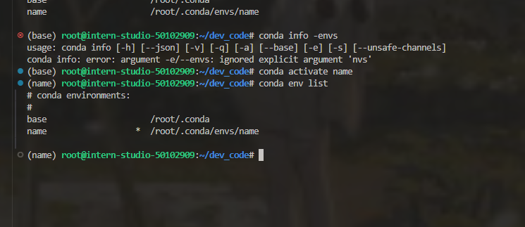

## Linux任务

闯关任务需要在关键步骤中截图：

|            | 任务描述                                      | 完成所需时间 |
| ---------- | --------------------------------------------- | ------------ |
| 闯关任务   | 完成SSH连接与端口映射并运行`hello_world.py`   | 10min        |
| 可选任务 1 | 将Linux基础命令在开发机上完成一遍             | 10min        |
| 可选任务 2 | 使用 VSCODE 远程连接开发机并创建一个conda环境 | 10min        |
| 可选任务 3 | 创建并运行`test.sh`文件                       | 10min        |

#### 闯关任务

##### 1.使用VsCode ssh连接Linux服务器.

- 1.在vscode扩展中安装Remote-SSH

- 2.安装完成插件以后，点击侧边栏的远程连接图标，在SSH中点击“+”按钮，添加开发机SSH连接的登录命令

- 3.如果大家以前是开发者的话,建议把配置一个新的.ssh/config文件,在扩展中找到Remote-SSH扩展设置中的 Remote.SSH: Config File 在方框中粘贴新的目录配置文件

  

- 4.输入连接SSH连接的登录命令,弹至新窗口后,输入点击Linux,输入粘贴入密码,连接成功后打开root文件目录进行使用


##### 2.远程连接后可以在root目录下创建一个dev_code目录用于存放编程文件,在vscode中远程连接服务器可以像在本地的新建文件文件夹和创建文件,也可以使用在命令窗口使用Linux命令创建.

- 1.新建dev_code文件夹.
- 2.新建hello_world.py文件.
- 3.在命令窗口中执行``` python hello_world.py```命令运行文件,输出结果.


---

#### 可选任务 2

#####  1.开发机中已经安装了conda,使用```conda create -n name python=3.10```创建一个环境名为name,python版本为3.10的conda虚拟环境.


##### 2.使用```conda env list```查看有哪些虚拟环境 ,其中 环境前标* 为当前的环境.


##### 3.使用```conda activate name```切换为name环境,在使用```conda env list```可以看到* 指向name环境.



---

#### 闯关任务3

##### 1.在dev_code目录下使用```touch test.sh```创建test.sh脚本文件.

##### 2.使用vi对test.sh文件进行编辑,在文件中写入```python hello_world.py```,点击esc键退出编辑,```shift + :```,输入```:wq```来退出并保存文件.


---


