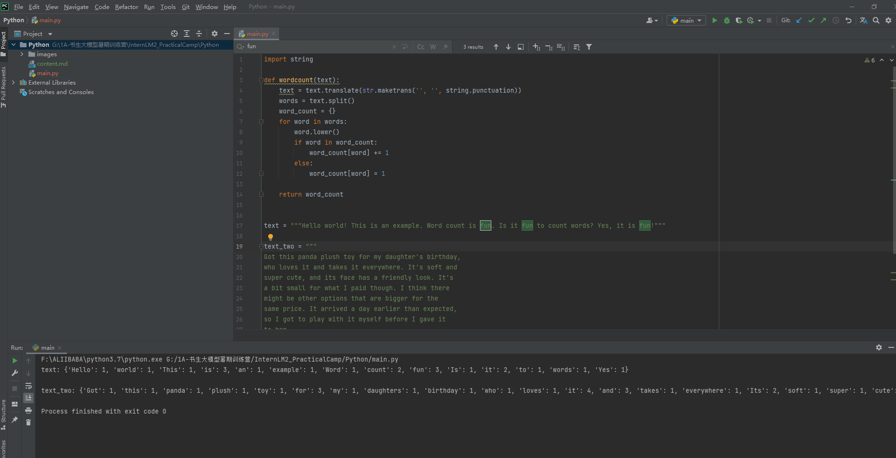
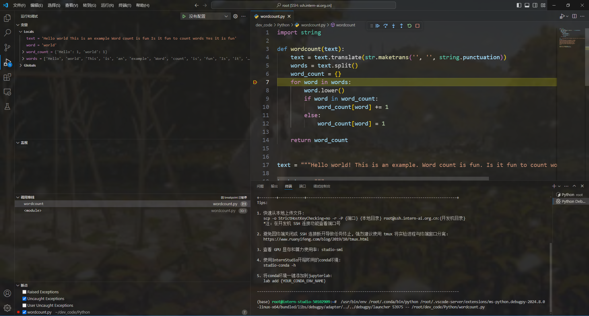

#### Python任务

### 任务一

请实现一个wordcount函数，统计英文字符串中每个单词出现的次数。返回一个字典，key为单词，value为对应单词出现的次数。

Eg:

Input:

```python
"""Hello world!  
This is an example.  
Word count is fun.  
Is it fun to count words?  
Yes, it is fun!"""
```

Output:

```python
{'hello': 1,'world!': 1,'this': 1,'is': 3,'an': 1,'example': 1,'word': 1, 
'count': 2,'fun': 1,'Is': 1,'it': 2,'to': 1,'words': 1,'Yes': 1,'fun': 1  }
```

TIPS：记得先去掉标点符号,然后把每个单词转换成小写。不需要考虑特别多的标点符号，只需要考虑实例输入中存在的就可以。

```python
text = """
Got this panda plush toy for my daughter's birthday,
who loves it and takes it everywhere. It's soft and
super cute, and its face has a friendly look. It's
a bit small for what I paid though. I think there
might be other options that are bigger for the
same price. It arrived a day earlier than expected,
so I got to play with it myself before I gave it
to her.
"""

def wordcount(text):
    pass

```

1.`str.translate` 方法根据指定的转换表替换字符串中的字符 ，使用```string.punctuation```去除标点符号， ``string.punctuation``是一个包含所有标点符号的字符串 。

2.使用```text.split()```将字符串按空格分割成单词。

3.创建一个循环使用```word_count```统计文本中每个单词出现的次数。



---

### 任务二

请使用本地vscode连接远程开发机，将上面你写的wordcount函数在开发机上进行debug，体验debug的全流程，并完成一份debug笔记(需要截图)。

1.使用vscode远程连接开发机，新建一个wordcount.py文件，将本地的代码CV进去。

2.在编程栏里在行号前面点击左鼠标键即可打上断点，这里把断点打在for循环处，可以查了遍历过程。

3.点击左边栏的运行和调试，进行调试。

