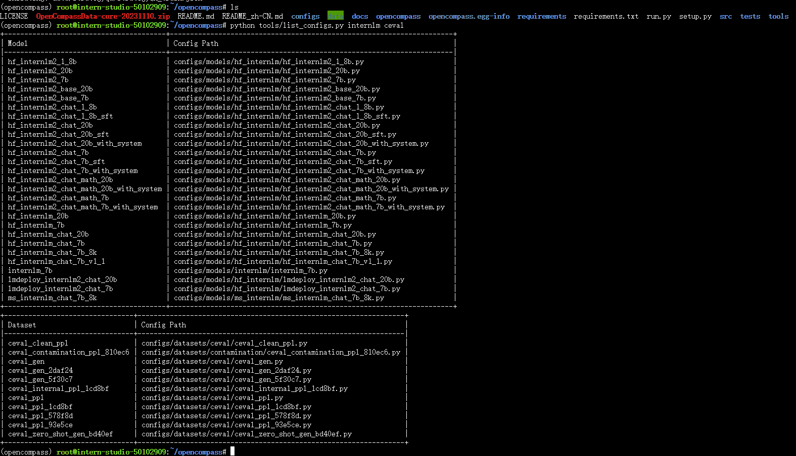
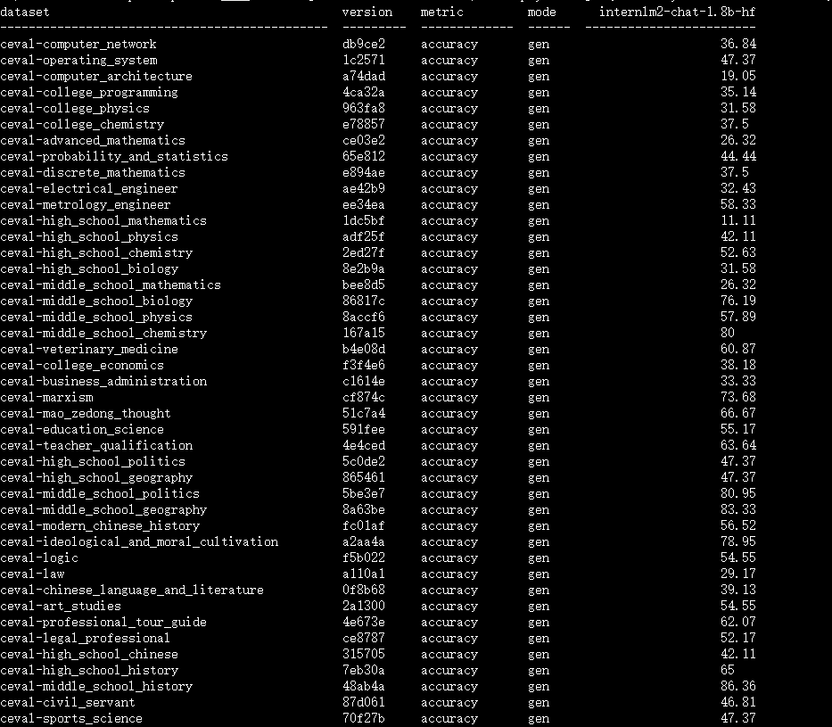
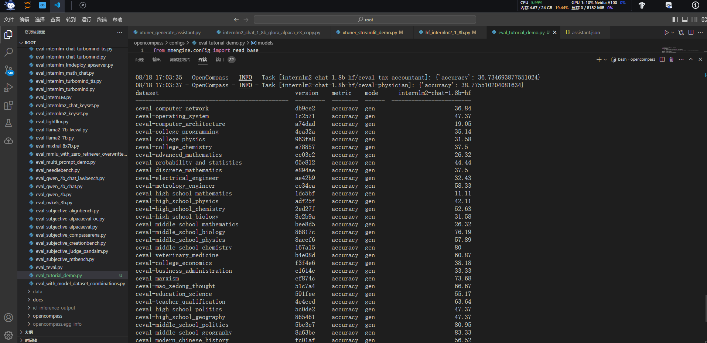

本文将进行使用 OpenCompass 来评测 InternLM2 1.8B实践

# 概览

在 OpenCompass 中评估一个模型通常包括以下几个阶段：配置 -> 推理 -> 评估 -> 可视化。

*   配置：这是整个工作流的起点。您需要配置整个评估过程，选择要评估的模型和数据集。此外，还可以选择评估策略、计算后端等，并定义显示结果的方式。
*   推理与评估：在这个阶段，OpenCompass 将会开始对模型和数据集进行并行推理和评估。推理阶段主要是让模型从数据集产生输出，而评估阶段则是衡量这些输出与标准答案的匹配程度。这两个过程会被拆分为多个同时运行的“任务”以提高效率。
*   可视化：评估完成后，OpenCompass 将结果整理成易读的表格，并将其保存为 CSV 和 TXT 文件。

接下来，我们将展示 OpenCompass 的基础用法，分别用命令行方式和配置文件的方式评测InternLM2-Chat-1.8B，展示书生浦语在 `C-Eval` 基准任务上的评估。更多评测技巧请查看 [https://opencompass.readthedocs.io/zh-cn/latest/get_started/quick_start.html](https://opencompass.readthedocs.io/zh-cn/latest/get_started/quick_start.html)  文档。

# 环境配置

## 创建开发机和 conda 环境

在创建开发机界面选择镜像为 Cuda11.7-conda，并选择 GPU 为10% A100。


## 安装——面向GPU的环境安装


```
conda create -n opencompass python=3.10
conda activate opencompass
conda install pytorch==2.1.2 torchvision==0.16.2 torchaudio==2.1.2 pytorch-cuda=12.1 -c pytorch -c nvidia -y

# 注意：一定要先 cd /root
cd /root
git clone -b 0.2.4 https://github.com/open-compass/opencompass
cd opencompass
pip install -e .


apt-get update
apt-get install cmake
pip install -r requirements.txt
pip install protobuf
```

# 数据准备

## 评测数据集
解压评测数据集到 `/root/opencompass/data/` 处。（注意： 上方在git clone opencompass 时一定要将 opencompass clone 到 /root 路径下）
```shell
cp /share/temp/datasets/OpenCompassData-core-20231110.zip /root/opencompass/
unzip OpenCompassData-core-20231110.zip
```
将会在 OpenCompass 下看到data文件夹

## InternLM和ceval 相关的配置文件

列出所有跟 InternLM 及 C-Eval 相关的配置

    python tools/list_configs.py internlm ceval

将会看到



# 启动评测 (10% A100 8GB 资源)

## 使用命令行配置参数法进行评测

打开 opencompass文件夹下configs/models/hf_internlm/的`hf_internlm2_chat_1_8b.py` ,贴入以下代码


```python
from opencompass.models import HuggingFaceCausalLM


models = [
    dict(
        type=HuggingFaceCausalLM,
        abbr='internlm2-1.8b-hf',
        path="/share/new_models/Shanghai_AI_Laboratory/internlm2-chat-1_8b",
        tokenizer_path='/share/new_models/Shanghai_AI_Laboratory/internlm2-chat-1_8b',
        model_kwargs=dict(
            trust_remote_code=True,
            device_map='auto',
        ),
        tokenizer_kwargs=dict(
            padding_side='left',
            truncation_side='left',
            use_fast=False,
            trust_remote_code=True,
        ),
        max_out_len=100,
        min_out_len=1,
        max_seq_len=2048,
        batch_size=8,
        run_cfg=dict(num_gpus=1, num_procs=1),
    )
]
```


确保按照上述步骤正确安装 OpenCompass 并准备好数据集后，可以通过以下命令评测 InternLM2-Chat-1.8B 模型在 C-Eval 数据集上的性能。由于 OpenCompass 默认并行启动评估过程，我们可以在第一次运行时以 --debug 模式启动评估，并检查是否存在问题。在 --debug 模式下，任务将按顺序执行，并实时打印输出。

```shell
#环境变量配置
export MKL_SERVICE_FORCE_INTEL=1
#或
export MKL_THREADING_LAYER=GNU
```

```shell
python run.py --datasets ceval_gen --models hf_internlm2_chat_1_8b --debug
```

命令解析

    python run.py
    --datasets ceval_gen \ # 数据集准备
    --models hf_internlm2_chat_1_8b \  # 模型准备
    --debug

如果一切正常，您应该看到屏幕上显示：

    [2024-08-09 16:48:07,016] [opencompass.openicl.icl_inferencer.icl_gen_inferencer] [INFO] Starting inference process...

评测完成后，将会看到：



## 使用配置文件修改参数法进行评测
除了通过命令行配置实验外，OpenCompass 还允许用户在配置文件中编写实验的完整配置，并通过 run.py 直接运行它。配置文件是以 Python 格式组织的，并且必须包括 datasets 和 models 字段。本次测试配置在 `configs`文件夹 中。此配置通过 继承机制 引入所需的数据集和模型配置，并以所需格式组合 datasets 和 models 字段。
运行以下代码，在configs文件夹下创建`eval_tutorial_demo.py`
```bash
cd /root/opencompass/configs
touch eval_tutorial_demo.py
```
打开`eval_tutorial_demo.py` 贴入以下代码
```python
from mmengine.config import read_base

with read_base():
    from .datasets.ceval.ceval_gen import ceval_datasets
    from .models.hf_internlm.hf_internlm2_chat_1_8b import models as hf_internlm2_chat_1_8b_models

datasets = ceval_datasets
models = hf_internlm2_chat_1_8b_models
```

因此，运行任务时，我们只需将配置文件的路径传递给 run.py：

```bash
cd /root/opencompass
python run.py configs/eval_tutorial_demo.py --debug
```

如果一切正常，您应该看到屏幕上显示：

    [2024-08-09 16:48:07,016] [opencompass.openicl.icl_inferencer.icl_gen_inferencer] [INFO] Starting inference process...

评测完成后，将会看到：



