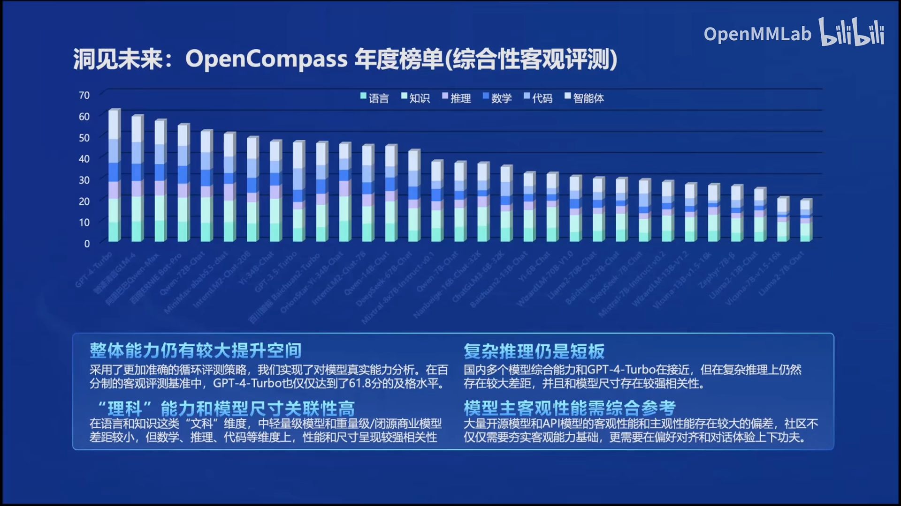

## 书生·浦语大模型全链路开源体系

#### 1.通用大模型发展

#### 2.书生葡语大模型开源历程

#### 3.语言建模的本质

#### 4.IternLM 2.0的亮点

#### 5.性能的提升(语言推理、数学推理、数学代码)

#### 6.GSM8K和MATH是当前典型的数学评测集（模型配合代码解释器得到了大幅度的提升）

#### 7.从模型到应用

#### 8.为了简化从模型到应用的过程，开发了全链条的工具体系并开源。这包括数据集、预训练框架、微调框架、部署解决方案、评测体系和智能体框架等。这些工具支持从数据准备、模型训练、微调、部署到评测的整个过程，旨在帮助开发者和研究者更容易地使用和开发大模型应用。 

#### 9.书生万卷1.0，开源的高质量数据集

#### 10.预训练(千卡级别),加速效率92%

#### 11. 微调：增量续训、有监督微调 

 #### 12.高效微调框架XTuner 

#### 13.OpenCompass2.0大模型评测体系

#### 14.LMDeploy模型部署（支持多种API调用）

#### 15.Langent智能体

