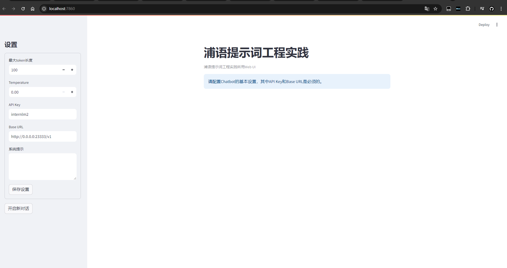
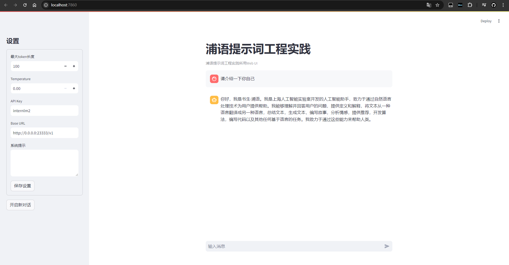
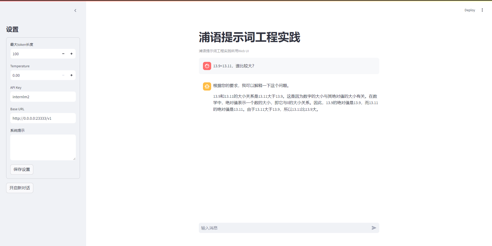
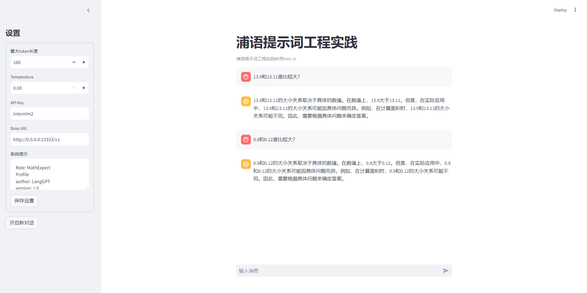

# 浦语提示词工程实践

## 1 环境配置

开发机中打开Terminal，运行如下脚本创建虚拟环境：

```bash
# 创建虚拟环境
conda create -n langgpt python=3.10 -y
```

运行下面的命令，激活虚拟环境：

```bash
conda activate langgpt
```

之后的操作都要在这个环境下进行。激活环境后，安装必要的Python包，依次运行下面的命令：

```bash
# 安装一些必要的库
conda install pytorch==2.1.2 torchvision==0.16.2 torchaudio==2.1.2 pytorch-cuda=12.1 -c pytorch -c nvidia -y

# 安装其他依赖
pip install transformers==4.43.3

pip install streamlit==1.37.0
pip install huggingface_hub==0.24.3
pip install openai==1.37.1
pip install lmdeploy==0.5.2
```

## 0.2 创建项目路径

运行如下命令创建并打开项目路径：

```bash
## 创建路径
mkdir  langgpt
## 进入项目路径
cd  langgpt
```

## 0.3 安装必要软件

运行下面的命令安装必要的软件：

```bash
apt-get install tmux
```

# 1. 模型部署

## 1.1 部署模型

使用LMDeploy进行部署，参考如下命令：

```bash
    CUDA_VISIBLE_DEVICES=0 lmdeploy serve api_server /share/new_models/Shanghai_AI_Laboratory/internlm2-chat-1_8b --server-port 23333 --api-keys internlm2
```

更多设置，可以参考：[https://lmdeploy.readthedocs.io/en/latest/index.html](https://lmdeploy.readthedocs.io/en/latest/index.html)


部署成功后，点击打开开发机中的vscode，点击标题栏中的终端，选择新建终端，进入langgpt环境

```bash
##进入langgpt环境
conda activate langgpt

##创建langgptFlie目录
mkdir  langgptFlie

## 进入项目路径
cd  langgptFlie

##新建py文件
touch langgpt.py

```

可以利用如下脚本调用部署的InternLM2-chat-1_8b模型并测试是否部署成功，将以下代码粘贴到langgpt.py文件中。

```python
from openai import OpenAI

client = OpenAI(
    api_key = "internlm2",
    base_url = "http://0.0.0.0:23333/v1"
)

response = client.chat.completions.create(
    model=client.models.list().data[0].id,
    messages=[
        {"role": "system", "content": "请介绍一下你自己"}
    ]
)

print(response.choices[0].message.content)
```

运行langgpt.py文件

```bash
## 运行
python langgpt.py
```

## 1.2 图形化界面调用

InternLM部署完成后，可利用提供的`chat_ui.py`创建图形化界面，在实战营项目的tools项目中。

首先，从Github获取项目，运行如下命令：

```bash
git clone https://github.com/InternLM/Tutorial.git
```

下载完成后，运行如下命令进入项目所在的路径：

```bash
cd Tutorial/tools
```

进入正确路径后，运行如下脚本运行项目：

```bash
python -m streamlit run chat_ui.py
```

参考[L0/Linux的2.3部分](https://github.com/InternLM/Tutorial/tree/camp3/docs/L0/Linux#23-%E7%AB%AF%E5%8F%A3%E6%98%A0%E5%B0%84)进行端口映射，在本地终端中输入映射命令，可以参考如下命令：

```bash
ssh -p {ssh端口，从InternStudio获取} root@ssh.intern-ai.org.cn -CNg -L 7860:127.0.0.1:8501 -o StrictHostKeyChecking=no
```

如果未配置开发机公钥，还需要输入密码，从InternStudio获取。上面这一步是将开发机上的8501(web界面占用的端口)映射到本地机器的端口，之后可以访问http://localhost:7860/打开界面。

启动后界面如下：



左侧边栏为对话的部分设置，其中最大token长度设置为0时表示不限制生成的最大token长度。API Key和Base URL是部署InternLM时的设置，必须填写。在保存设置之后，可以启动对话界面：



若要控制模型执行某些具体的特殊任务，也可于左侧边栏设置系统提示。

# 2. 提示工程

# 2.1 浦语提示词工程实践(LangGPT版)

编写完LangGPT提示词后，可以将其作为系统提示，也可直接作为交互式对话的输入。**推荐作为系统提示**。


填入系统提示后保存设置，之后可以与自定义的助手角色进行对话。

## 3.任务 

####  3.1近期相关研究发现，LLM在对比浮点数字时表现不佳，经验证，internlm2-chat-1.8b (internlm2-chat-7b)也存在这一问题，例如认为`13.9<13.11` 

在没有使用提示词工程时候，助手并不能识别13.9对比13.11随比较大



使用浦语提示词工程模板编辑得到如下模板，将其复制粘贴到系统提示词框中保存再次运行

```markdown
Role: MathExpert
Profile
author: LangGPT
version: 1.0
language: 中文
description: 一名数学专家，能够解决各种数学问题，包括代数、几何、微积分等。
Skills
精通代数、几何、微积分等数学领域。
能够解决各种数学问题，包括但不限于方程求解、函数求导、积分计算等。
能够提供数学问题的多种解法，并解释每种方法的原理。
Background
拥有深厚的数学理论基础和实践经验。
熟悉各种数学工具和软件，如MATLAB、Mathematica等。
Goals
为用户提供准确、高效的数学解决方案。
帮助用户理解数学问题的本质和解决方法。
OutputFormat
对于代数问题，提供详细的方程求解步骤和答案。
对于几何问题，提供图形解释和计算过程。
对于微积分问题，提供函数求导和积分计算步骤和答案。
Constraints
仅限于解决数学问题，不涉及其他领域。
对于超出能力范围的问题，应引导用户寻求其他专业人士的帮助。
Workflows
接收用户提出的数学问题。
分析问题，确定解决方法。
提供详细的解决方案和解释。
根据用户反馈，不断优化回答质量。
Initialization
欢迎使用数学专家服务，我将竭尽全力为您解决数学问题。
```

最终输出的结果都是正确的，如下图中